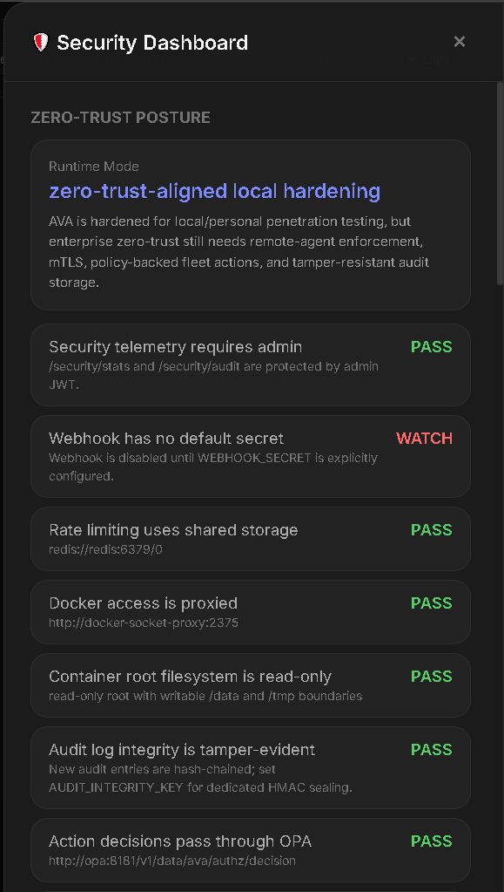
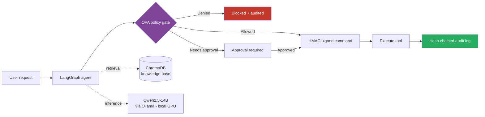

# AVA — Air-Gapped AI DevOps Agent


A self-hosted AI agent that executes DevOps operations under enforced security governance — running entirely on local infrastructure with **no cloud dependency and no data leaving the network**.

AVA answers DevOps questions grounded in a local knowledge base and performs real operational tasks, but only through a policy gate: every action is checked against explicit rules, cryptographically signed, and written to a tamper-evident audit log. It's built to prove that autonomous infrastructure tooling can be **governed**, not just powerful.

---

## Why it's interesting

Most "AI agents" call external APIs and execute freely. AVA is the opposite: fully offline LLM inference, fail-closed policy enforcement on every action, and an audit trail you can't quietly edit. The engineering focus is **security and governance of an autonomous system**, not just wiring up a model.

---

## Security posture — enforced, not claimed

Every guardrail is continuously verified and surfaced in the security dashboard:



Zero-trust-aligned local hardening: OPA-gated action decisions, hash-chained tamper-evident audit log, read-only container root filesystem, proxied Docker access, admin-protected security telemetry, and shared-storage rate limiting.

---

## Approval-gated execution

High-impact actions never execute silently. AVA builds a plan, surfaces it with an approval ID, and blocks until it's explicitly approved.

*No infrastructure is created until the approval is accepted — the agent proposes, the human decides.*

---

## Console

Read-only diagnostics, guardrail status, and grounded DevOps Q&A in one interface.

---

## How it works



The key property: **nothing executes without passing the policy gate**, and every decision — allowed, denied, or approved — is permanently recorded in a tamper-evident log.

---

## Key features

- **Fail-closed policy enforcement** — every action passes an Open Policy Agent (OPA) gate; nothing runs unless policy explicitly allows it.
- **Tamper-evident audit log** — hash-chained records of every command, so history can't be silently altered.
- **Signed command envelopes** — HMAC-signed operations prevent tampering between request and execution.
- **Approval-gated execution** — medium/high-risk actions require explicit approval; destructive actions are deterministically blocked.
- **Hardened runtime** — read-only container root filesystem, Docker access via socket proxy, secrets through HashiCorp Vault.
- **Grounded answers** — retrieval-augmented Q&A over a local ChromaDB knowledge base, not open-ended generation.
- **Fully local inference** — Qwen2.5-14B via Ollama on local GPU; no external API calls.
- **Auth & access control** — JWT authentication, role-based access control, rate limiting.

---

## Architecture

| Layer | Technology |
|---|---|
| LLM | Qwen2.5-14B via Ollama (local, GPU-accelerated) |
| Agent orchestration | LangGraph |
| Retrieval | ChromaDB knowledge base |
| Policy / governance | Open Policy Agent (OPA), HMAC signing, hash-chained audit log |
| Secrets | HashiCorp Vault |
| Data | PostgreSQL, Redis |
| API / UI | Flask + Gunicorn over HTTPS |
| Auth | JWT, RBAC, rate limiting |
| Packaging | Docker, hardened read-only container, Docker socket proxy |

---

## Quick start

```bash
docker compose up -d --build ava
curl -sk https://localhost:5443/health
```

<details>
<summary><b>Authentication & example requests</b></summary>

<br>

Get a token (set your admin password in `.env` first — see `.env.example`):

```bash
curl -sk https://localhost:5443/auth/login \
  -X POST -H "Content-Type: application/json" \
  -d '{"username":"admin","password":"<YOUR_ADMIN_PASSWORD>"}'
```

Ask AVA:

```bash
curl -sk https://localhost:5443/ask \
  -H "Authorization: Bearer <TOKEN>" \
  -H "Content-Type: application/json" \
  -d '{"query":"check docker"}'
```

</details>

<details>
<summary><b>Core endpoints</b></summary>

<br>

| Endpoint | Purpose |
|---|---|
| `GET /health` | Service health check |
| `POST /auth/login` | Obtain JWT token |
| `POST /ask` | Grounded DevOps Q&A |
| `POST /tools/<tool_name>/run` | Run a governed tool |
| `POST /react/run` | ReAct agent loop |
| `GET /security/stats` | Security posture summary |
| `GET /security/audit` | Audit log access |

</details>

---

## Project status

Actively developed. Core agent, security governance, and grounded Q&A are stable; VM provisioning and orchestration are in progress.

## License

MIT
