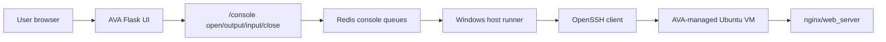

# AVA v2 Phase 9.8 - Real Web Terminal

Date: 2026-06-04
Branch: v2-development

## Goal

Phase 9.8 moves AVA from a basic browser SSH console toward a real web terminal experience.

The product goal is simple:

- AVA opens a browser-accessible terminal for AVA-managed VMs.
- The user should not need PuTTY installed on the browser machine.
- The terminal must remain behind AVA authentication and policy boundaries.
- AVA must not expose private SSH keys or reprint temporary passwords.
- The terminal should behave increasingly like PuTTY while preserving AVA's audit and safety model.

## Current Phase 9.8 Slice

This slice upgrades the Phase 9.7 console from command-line submit behavior to interactive key mode.

Implemented behavior:

- The console output pane is now keyboard-focusable.
- Normal printable keys are sent directly to the SSH session.
- Enter sends newline.
- Backspace sends the terminal delete character.
- Tab is forwarded to the shell.
- Arrow keys are forwarded as terminal escape sequences.
- Ctrl+C sends interrupt.
- Ctrl+D sends end-of-input.
- Ctrl+L sends clear-screen and clears the browser console view.
- The VM shell is opened with an xterm-compatible `TERM` so Linux commands such as `clear` can emit normal terminal clear sequences.
- Paste into the terminal pane forwards pasted text to the VM.
- The old command bar remains as an optional paste/full-line fallback.
- Console input rate limit was increased for the authenticated console input endpoint so normal typing does not trigger AVA's generic safety limiter.
- Reconnect/open actions reset stale failed console state before opening a new session.

This makes the console much closer to a terminal while keeping the existing Redis/host-runner bridge stable.

## Current Architecture

## Why This Is Not Yet Final xterm/PuTTY Mode

The current AVA app is served through Flask/Gunicorn as a WSGI application. WSGI HTTP routes are good for normal API calls, but they are not a native bidirectional terminal stream.

True PuTTY-class browser terminal behavior needs:

- xterm.js or equivalent terminal renderer, vendored locally.
- A WebSocket transport for low-latency bidirectional streaming.
- A server boundary that can handle WebSocket upgrades.
- PTY resize support.
- Strong session ownership, idle timeout, and audit controls.

Phase 9.8 therefore lands in safe slices instead of replacing the serving core in one risky jump.

## Security Boundaries

The web terminal must follow these rules:

- AVA authentication is required before opening a console.
- A console session is scoped to the authenticated user.
- The target must be an AVA-managed VM unless a later approved allowlist feature is added.
- Runner SSH keys stay on the Windows host runner.
- The browser never receives private keys.
- AVA does not pass or reprint the VM temporary password.
- Console sessions expire after inactivity.
- Console input remains scoped to the active console session.

## Acceptance Checklist

Phase 9.8 interactive key mode is acceptable when:

- `whoami` runs from the browser terminal.
- `hostname` runs from the browser terminal.
- `systemctl --no-pager status nginx` returns without opening a pager.
- `curl -I http://127.0.0.1` returns HTTP 200.
- Backspace works while editing a command.
- Tab is forwarded to the shell.
- Arrow-up recalls shell history.
- Ctrl+C interrupts a running command.
- Ctrl+L clears the browser terminal view.
- The Linux `clear` command clears the browser terminal view.
- Reconnect can recover from an old failed console panel without refreshing the whole AVA page.
- Opening the console does not require PuTTY on the browser machine.
- AVA still refuses to open a console when no AVA-managed VM is available.

## Remaining Work

Recommended next slices:

- Phase 9.11: xterm-lite renderer foundation.
- Phase 9.12: vendor xterm.js locally, no CDN dependency.
- Phase 9.13: introduce a WebSocket terminal transport behind AVA authentication.
- Phase 9.14: add terminal resize support.
- Phase 9.15: add an optional approved manual SSH target flow for IP/port/username access, with allowlist and audit.

## Phase 9.9 - Console Reliability And UX Polish

Date: 2026-06-04

Phase 9.9 hardens the browser console experience around the messy operational
edges that made the console feel unreliable.

Implemented behavior:

- AVA exposes a console readiness endpoint at `/console/status`.
- The readiness response reports whether the Windows host runner heartbeat is
  online.
- The readiness response reports whether an AVA-managed VM target is available.
- The console UI has a manual `Check` action so the user can see why the console
  can or cannot open.
- Opening the console while the runner is offline now returns an actionable
  message: start AVA with `scripts/start-ava.ps1`, then retry.
- Opening the console when no AVA-managed VM exists now says no console target
  is available instead of failing generically.
- Queued console sessions that never get picked up by the host runner are marked
  failed after a timeout instead of remaining stuck forever.
- Failed or closed sessions tell the user to click `Reconnect` for a fresh
  console session.
- Repeated polling rate-limit noise is throttled so the console does not flood
  the panel with the same message.
- Runner heartbeat details can be read as structured payload, not only as a
  boolean.

This does not change the security model: AVA remains the authenticated gateway,
the browser does not receive SSH private keys, and the console still targets
AVA-managed VMs only.

## Phase 9.9 Acceptance Checklist

Phase 9.9 is acceptable when:

- `/console/status` returns runner health and target availability.
- If the host runner is offline, Web Console clearly says the runner must be
  started before opening.
- If no AVA-managed VM exists, Web Console clearly says no target is available.
- A stale queued console session fails with a reconnect instruction.
- Reconnect opens a fresh console session after a failed/stale session.
- Console rate-limit messages are not spammed continuously.
- The Phase 9 runner bridge regression suite passes.

## Phase 9.10 - Browser-Side Terminal Editing Foundation

Date: 2026-06-04

Phase 9.10 improves the console editing feel without replacing the serving
stack yet. AVA still uses the existing authenticated HTTP polling bridge, but
the browser now behaves less like a plain `<pre>` log view and more like a
terminal input surface.

Implemented behavior:

- Printable keys are locally echoed in the browser immediately.
- Backspace removes the locally typed character immediately instead of waiting
  for delayed SSH echo handling.
- The browser tracks how many characters are editable on the current command
  line so Backspace does not erase the shell prompt.
- Remote SSH echo for locally typed characters is suppressed to avoid duplicate
  command text.
- Remote Backspace/delete echo is suppressed when it corresponds to a
  Backspace already handled locally.
- Enter still sends the command to the VM and resets the local editable range.
- The existing Ctrl+C, Ctrl+D, Ctrl+L, paste bar, Reconnect, Check, and
  readiness behavior remains unchanged.

This is intentionally not marketed as full PuTTY parity. It is a safe
foundation slice that makes everyday command editing usable while preserving
the current AVA gateway, authentication, and runner boundaries.

## Phase 9.10 Acceptance Checklist

Phase 9.10 is acceptable when:

- Typing appears immediately in the Web Console.
- Backspace visually corrects a mistyped command before Enter.
- Backspace does not delete the shell prompt.
- Normal command output still appears after Enter.
- Remote echo does not duplicate the same typed command text.
- Ctrl+L still clears the browser terminal view.
- The `clear` command still clears the browser terminal view.
- Reconnect still opens a fresh session when needed.
- The browser still does not receive SSH private keys or VM passwords.
- The Phase 9 runner bridge regression suite passes.

## Phase 9.11 - xterm-lite Renderer Foundation

Date: 2026-06-04

Phase 9.11 replaces the plain append-only console rendering behavior with an
AVA-owned terminal screen model. This is still not the final WebSocket/xterm.js
transport, but it removes the biggest limitation of the old `<pre>` console:
the browser no longer treats terminal output as one long text log.

Implemented behavior:

- AVA now identifies the browser console renderer as `ava_xterm_lite`.
- The browser maintains a terminal line buffer and cursor position.
- Output is rendered from the terminal buffer instead of raw append-only text.
- Carriage return moves the cursor back to column zero.
- Newline advances the terminal row and resets the cursor column.
- Backspace deletes from the editable terminal line without deleting the shell
  prompt.
- Backspace and Tab are shell-owned: AVA sends them directly to the SSH
  session and waits for bash/readline to echo the real deletion or completion
  behavior instead of inserting fake browser-side characters.
- Printable keys and Enter are also remote-echo authoritative. AVA no longer
  fakes typed characters in the browser before the SSH shell echoes them back,
  because browser-side echo can drift from bash/readline redraw sequences and
  produce corrupted text such as visible `[K` fragments.
- The browser console filters browser-repeat key events and accidental duplicate
  keydown events before sending input to SSH. This now covers printable keys and
  control keys such as Ctrl+C, protecting commands from appearing as repeated
  characters when the browser fires repeat or duplicate key events.
- Handled terminal key events are stopped at the console boundary so they do not
  leak into parent browser handlers or the chat input surface.
- Console polling was tightened and AVA asks for fresh output immediately after
  key input, reducing the visible delay while the transport is still HTTP
  polling.
- AVA now guards output polling with an in-flight lock. If a fast poll and the
  regular timer ask for the same output offset at the same time, stale results
  are ignored so SSH echo is not rendered twice as `hhosstnname`.
- The authenticated console output route allows low-latency polling without
  tripping AVA's generic safety throttle, and rare throttle backoff is kept out
  of the terminal text.
- OpenSSH known-host warning noise is suppressed for browser console sessions.
- ANSI clear-screen sequences reset the terminal screen model.
- ANSI erase-line sequences clear from the cursor to the end of the active
  line.
- A visual blinking cursor is rendered in the console pane.
- Scrollback is bounded so long sessions do not grow the browser text forever.

The security boundary remains unchanged:

- AVA authentication is still required.
- The browser still never receives SSH private keys.
- The browser still never receives the temporary VM password after approval.
- Console access still targets AVA-managed VMs through the Windows host runner.

## Phase 9.11 Acceptance Checklist

Phase 9.11 is acceptable when:

- Web Console status/readiness reports the renderer as `ava_xterm_lite`.
- The console shows a cursor.
- `whoami` and `hostname` still work.
- Mistyped commands can be corrected with Backspace before Enter.
- Tab is delivered to the VM for shell completion and does not insert fake
  spaces in the browser.
- Key input feels responsive enough for basic administration, while full
  PuTTY-like latency remains a WebSocket/xterm.js milestone.
- Typed command text is rendered from the VM shell echo, not from fake
  browser-side echo.
- Normal typing does not duplicate characters such as `hostname` becoming
  `hosstttnaa`.
- Overlapping output polls do not duplicate VM shell echo.
- Ctrl+C is sent once when pressed once, not duplicated as `^CC`.
- New console sessions do not show OpenSSH known-host warning noise.
- `clear` and Ctrl+L clear the browser terminal screen.
- `systemctl --no-pager status nginx` returns output without breaking the
  terminal view.
- Reconnect still opens a fresh session.
- The Phase 9 runner bridge regression suite passes.

## Product Note

This phase should not expose raw SSH publicly. AVA should remain the gateway. That is the product advantage: browser access, governed execution, local-first operation, and auditability without depending on PuTTY on every client machine.

## Demo Reliability Note

For Phase 9 demo safety, AVA now treats an in-progress provisioning job as
orphaned when the Windows host runner stops reporting healthy for more than a
short grace period. This prevents a deleted VM or crashed/stopped runner from
leaving the chat stuck forever in `queued`, `provisioning`, or `bootstrapping`.

Expected behavior:

- If the runner is offline before approval, AVA refuses to issue credentials or
  queue a VM.
- If the runner stops after a job is already queued or picked up, AVA marks the
  old attempt failed after the grace period and allows a fresh request.
- If a previously completed VM was manually deleted from VirtualBox, AVA should
  rely on live runner verification instead of old stored evidence before
  blocking a new server request.
