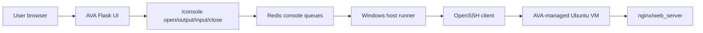

# AVA v2 Phase 9.8 - Real Web Terminal

Date: 2026-06-04
Branch: v2-development

## Goal

Phase 9.8 moves AVA from a basic browser SSH console toward a real web terminal experience.

The product goal is simple:

- AVA opens a browser-accessible terminal for AVA-managed VMs.
- The user should not need PuTTY installed on the browser machine.
- The terminal must remain behind AVA authentication and policy boundaries.
- AVA must not expose private SSH keys or reprint temporary passwords.
- The terminal should behave increasingly like PuTTY while preserving AVA's audit and safety model.

## Current Phase 9.8 Slice

This slice upgrades the Phase 9.7 console from command-line submit behavior to interactive key mode.

Implemented behavior:

- The console output pane is now keyboard-focusable.
- Normal printable keys are sent directly to the SSH session.
- Enter sends newline.
- Backspace sends the terminal delete character.
- Tab is forwarded to the shell.
- Arrow keys are forwarded as terminal escape sequences.
- Ctrl+C sends interrupt.
- Ctrl+D sends end-of-input.
- Ctrl+L sends clear-screen and clears the browser console view.
- The VM shell is opened with an xterm-compatible `TERM` so Linux commands such as `clear` can emit normal terminal clear sequences.
- Paste into the terminal pane forwards pasted text to the VM.
- The old command bar remains as an optional paste/full-line fallback.
- Console input rate limit was increased for the authenticated console input endpoint so normal typing does not trigger AVA's generic safety limiter.
- Reconnect/open actions reset stale failed console state before opening a new session.

This makes the console much closer to a terminal while keeping the existing Redis/host-runner bridge stable.

## Current Architecture

## Why This Is Not Yet Final xterm/PuTTY Mode

The current AVA app is served through Flask/Gunicorn as a WSGI application. WSGI HTTP routes are good for normal API calls, but they are not a native bidirectional terminal stream.

True PuTTY-class browser terminal behavior needs:

- xterm.js or equivalent terminal renderer, vendored locally.
- A WebSocket transport for low-latency bidirectional streaming.
- A server boundary that can handle WebSocket upgrades.
- PTY resize support.
- Strong session ownership, idle timeout, and audit controls.

Phase 9.8 therefore lands in safe slices instead of replacing the serving core in one risky jump.

## Security Boundaries

The web terminal must follow these rules:

- AVA authentication is required before opening a console.
- A console session is scoped to the authenticated user.
- The target must be an AVA-managed VM unless a later approved allowlist feature is added.
- Runner SSH keys stay on the Windows host runner.
- The browser never receives private keys.
- AVA does not pass or reprint the VM temporary password.
- Console sessions expire after inactivity.
- Console input remains scoped to the active console session.

## Acceptance Checklist

Phase 9.8 interactive key mode is acceptable when:

- `whoami` runs from the browser terminal.
- `hostname` runs from the browser terminal.
- `systemctl --no-pager status nginx` returns without opening a pager.
- `curl -I http://127.0.0.1` returns HTTP 200.
- Backspace works while editing a command.
- Tab is forwarded to the shell.
- Arrow-up recalls shell history.
- Ctrl+C interrupts a running command.
- Ctrl+L clears the browser terminal view.
- The Linux `clear` command clears the browser terminal view.
- Reconnect can recover from an old failed console panel without refreshing the whole AVA page.
- Opening the console does not require PuTTY on the browser machine.
- AVA still refuses to open a console when no AVA-managed VM is available.

## Remaining Work

Recommended next slices:

- Phase 9.9: console reliability and UX polish.
- Phase 9.10: vendor xterm.js locally, no CDN dependency.
- Phase 9.11: introduce a WebSocket terminal transport behind AVA authentication.
- Phase 9.12: add terminal resize support.
- Phase 9.13: add an optional approved manual SSH target flow for IP/port/username access, with allowlist and audit.

## Phase 9.9 - Console Reliability And UX Polish

Date: 2026-06-04

Phase 9.9 hardens the browser console experience around the messy operational
edges that made the console feel unreliable.

Implemented behavior:

- AVA exposes a console readiness endpoint at `/console/status`.
- The readiness response reports whether the Windows host runner heartbeat is
  online.
- The readiness response reports whether an AVA-managed VM target is available.
- The console UI has a manual `Check` action so the user can see why the console
  can or cannot open.
- Opening the console while the runner is offline now returns an actionable
  message: start AVA with `scripts/start-ava.ps1`, then retry.
- Opening the console when no AVA-managed VM exists now says no console target
  is available instead of failing generically.
- Queued console sessions that never get picked up by the host runner are marked
  failed after a timeout instead of remaining stuck forever.
- Failed or closed sessions tell the user to click `Reconnect` for a fresh
  console session.
- Repeated polling rate-limit noise is throttled so the console does not flood
  the panel with the same message.
- Runner heartbeat details can be read as structured payload, not only as a
  boolean.

This does not change the security model: AVA remains the authenticated gateway,
the browser does not receive SSH private keys, and the console still targets
AVA-managed VMs only.

## Phase 9.9 Acceptance Checklist

Phase 9.9 is acceptable when:

- `/console/status` returns runner health and target availability.
- If the host runner is offline, Web Console clearly says the runner must be
  started before opening.
- If no AVA-managed VM exists, Web Console clearly says no target is available.
- A stale queued console session fails with a reconnect instruction.
- Reconnect opens a fresh console session after a failed/stale session.
- Console rate-limit messages are not spammed continuously.
- The Phase 9 runner bridge regression suite passes.

## Product Note

This phase should not expose raw SSH publicly. AVA should remain the gateway. That is the product advantage: browser access, governed execution, local-first operation, and auditability without depending on PuTTY on every client machine.
